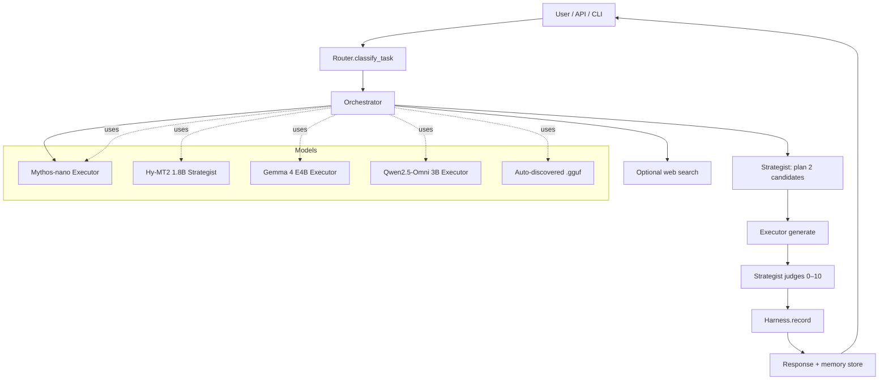
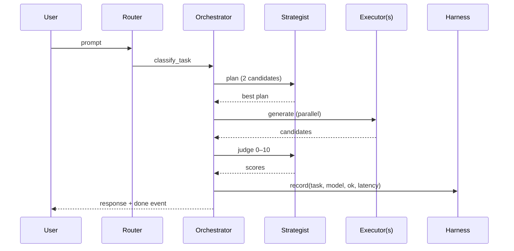
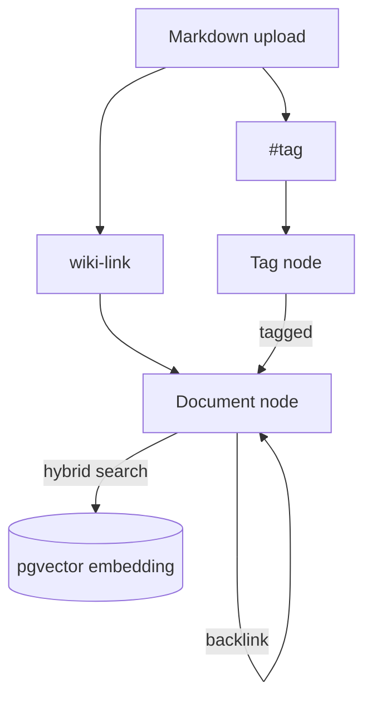

# Sovereign-Agentic-AI

<p align="center">
  
</p>

<p align="center">
  <b>A fully local, privacy-first, multi-agent LLM system that plans, routes, and executes — entirely on your hardware.</b>
</p>

<p align="center">
  <a href="https://github.com/rbkhan007/Sovereign-Agentic-AI/actions/workflows/ci.yml">
    
  </a>
  <a href="https://img.shields.io/badge/tests-808%20%2F%200-brightgreen?style=flat-square">
    
  </a>
  <a href="https://img.shields.io/badge/version-v1.3-blue?style=flat-square">
    
  </a>
  <a href="https://img.shields.io/badge/python-3.10%2B-blue?style=flat-square">
    
  </a>
  <a href="https://img.shields.io/badge/license-MIT-blue?style=flat-square">
    
  </a>
  <a href="https://img.shields.io/badge/backend-llama.cpp%20(Vulkan)-orange?style=flat-square">
    
  </a>
  <a href="https://img.shields.io/badge/frontend-Next.js%20%2B%20TS-8A2BE2?style=flat-square">
    
  </a>
  <a href="https://img.shields.io/badge/static%20audit-clean-success?style=flat-square">
    
  </a>
</p>

---

## 📖 About

**Sovereign-Agentic-AI** is an open-source, local-first agentic AI stack. It turns small
open-weight models (running on your CPU/GPU through `llama.cpp`) into a **cooperating team**:
a *Strategist* that reasons about the task and writes a plan, a *Router* that picks the
best *Executor* model for the job, and (optionally) several executors that answer in
parallel while the strategist *judges* the best reply.

It is built for people who want the power of agentic AI **without sending their data to a
cloud**. Chat, memory, the knowledge graph, image generation, vision, AutoML and the
self-healing agent all run on your machine. The only network calls are the ones you
explicitly turn on (an optional OpenAI/Claude/Groq/OpenRouter/Gemini fallback and optional
web search).

> **One-line summary:** *Plan → Route → Execute → Judge → Remember*, all offline by default.

---

## 🎯 Why this exists

Most local LLM tools are single-model chat wrappers. Sovereign-Agentic-AI exists to show
that a **small, coordinated multi-agent system** can punch above its weight:

| Pillar | What it means |
|--------|---------------|
| 🧠 **Reasoning via planning** | A dedicated strategist model plans before answering, improving quality on code, math and multi-step tasks |
| 🎯 **Adaptive routing** | A learned fitness score picks the right executor per task instead of always using the biggest model |
| ⚖️ **Accountability** | Every answer is judged, scored and recorded, so quality is measurable |
| 🧵 **Memory that compounds** | Conversations, documents and wiki-links become a queryable knowledge graph |
| 🔒 **Privacy by construction** | No telemetry, no forced cloud, no lock-in |

---

## 🚀 Quick start

```bash
# 1. Install
pip install -e .          # or: pip install -r requirements.txt

# 2. Add models — drop .gguf files into models/ (auto-discovered)
#    Expected: Hy-MT2-1.8B, Gemma 4 E4B, Qwen2.5-Omni 3B, Mythos-nano

# 3. Run
python run.py                                  # full mode (recommended)
python run.py web                              # Web UI only
python run.py cli                              # Terminal CLI only
python run.py --image-gen --vision --automl    # enable opt-in features
python run.py --db --db-password postgres       # PostgreSQL + pgvector memory
python run.py --nextjs                         # Next.js dev server on :3001
```

<details>
<summary><b>📂 Typical workflows</b></summary>

- **WebUI (multipage):** `/` landing (architecture flow, hardware models, Hugging Face guide, datasets, live system pulse), `/dashboard` live metrics, `/terminal` Agentic Terminal with CLI setup guide
- **Chat (UI):** Open dashboard, pick agent/skill, stream answers
- **Chat (API):** `POST /v1/chat/completions` (OpenAI-compatible) or `POST /v1/chat/auto-stream`
- **Knowledge:** Upload `.md` to workspace → wiki-links, `#tags`, backlinks become searchable graph
- **Automation:** Drive via `/mcp` JSON-RPC from external tools
- **Evaluation:** `python -m arc` / ARC endpoint for grid-reasoning accuracy

</details>

---

## 🏗️ Architecture

### System overview



### Request lifecycle



### Knowledge graph structure



---

## ⚙️ How it works

### 1. Task classification
```text
classify_task(text) → {code, math, summarize, translate, tool, creative, general}
```

### 2. Planning — two candidate plans
The strategist generates **2 candidate plans** at temperatures `0.3 + i*0.1`:

```text
score(plan) = len(plan)
           + 10 × 1{"FINAL_ANSWER" in plan}
           +  5 × 1{len(plan) > 50}

best_plan = argmax score(plan)
```

### 3. Adaptive harness — fitness score
Each `(task, model)` earns fitness from **success**, **speed** and **recency**:

```text
success = 1 − errors / attempts
speed   = min(2.0, 1 / avg_latency)
recent  = decay ^ age  (decay = 0.95)

fitness(task, model) = 60×success + 30×speed + 10×recent
```

Routing is **epsilon-greedy** (`ε = 0.15`):

```text
choose(task, candidates):
    15% → random(candidates)    # explore
    85% → best fitness          # exploit
```

### 4. Parallel execution & judging
Up to `parallel_max` executors answer concurrently; strategist scores each 0–10:

```text
final = argmax_m judge(question, answer_m)
```

### 5. Auto-streaming decision
```text
stream when:
  auto_stream enabled
  AND max_tokens ≤ cap (2048)
  AND (planning ON OR msg > 100 chars OR code/creative keywords)
```

### 6. Throughput
```text
tokens_per_sec_window = tokens(last 60s) / 60
tokens_per_sec        = total_tokens_out / uptime
```

### 7. ARC reasoning accuracy
```text
matches(pred, target):
  exact: parse_grid(pred) == target
  else:  shape match + element-wise equality
```

---

## 🛠️ Capabilities

| Capability | Status | Notes |
|------------|--------|-------|
| Multi-agent plan → execute → judge | ✅ | Hy-MT2 plans, executors run, strategist judges |
| Adaptive per-task model routing | ✅ | Epsilon-greedy harness fitness |
| Parallel multi-model answers | ✅ | ≤ `parallel_max`, judged 0–10 |
| Token streaming + auto-stream | ✅ | SSE, per-request stream/batch decision |
| GBNF auto-approved workflow | ✅ | `[THINK]` / `[BASH]` / `[READ]` / `[WRITE]` / `[DONE]` agent loop |
| Workspaces + file knowledge | ✅ | Chunk-embedded, per-workspace search |
| Knowledge graph (wiki-links, tags, backlinks) | ✅ | pgvector + recursive-CTE shortest path |
| Agents & skills (API/CLI/MCP) | ✅ | Runtime CRUD, JSON-persisted, MCP discovery |
| Multipage WebUI (Next.js) | ✅ | Landing `/` + live `/dashboard` + Terminal `/terminal` |
| Agentic Terminal | ✅ | Sandboxed shell / Python / file-tree + `/v1/terminal/*` API |
| Image generation (Stable Diffusion) | ✅ opt-in | CPU, RAM-guarded, 256–512 px |
| Vision (Gemma 3) | ✅ default-on | CPU, resource-guarded, lazy-load |
| AutoML (auto-sklearn) | ✅ opt-in | Linux-only |
| Self-healing agent | ⚠️ gated | Diagnosis always; execution needs `--allow-unsafe-healing` |
| OpenAI-compatible API | ✅ | Drop-in `/v1/chat/completions` |
| Cloud fallback | ✅ opt-in | Rate-limited OpenAI/Claude/Groq/OpenRouter/Gemini |
| Model management UI | ✅ | Pull from URL, install, uninstall, sizes |
| Hardware monitor (SSE) | ✅ | 1s SSE, LRU eviction, CPU throttle |
| CLI tab-completion + help | ✅ | Readline + Windows custom editor, categorized `/help` |

---

## 📤 Outputs

| Output | Shape | Notes |
|--------|-------|-------|
| Chat completion | OpenAI-style JSON | `choices[0].message.content` (+ optional `thinking`) |
| Streaming events | SSE `start → thinking? → response* → done` | `done` carries `tokens` + `elapsed` |
| Plan / thinking | text | Surfaced in UI and SSE |
| Ranked candidates | dict | Each model's answer + judge score (parallel mode) |
| Memory | pgvector rows | Q/A + graph nodes/edges |
| Knowledge graph | nodes/edges/tags | Wiki-links, `#tags`, backlinks, shortest path |
| Images | `generated/*.png` | From `--image-gen` |
| Vision | description text | From `--vision` |
| AutoML model | `.pkl` | From `--automl` |
| Metrics / Harness stats | JSON | `success_rate`, `avg_latency`, `tokens_per_sec_window`, fitness |
| Workflow trace events | SSE `status → trace → trace_result → complete/error` | Live GBNF action stream |
| Hardware readings | SSE JSON (1s interval) | RAM, VRAM, CPU via `/v1/hardware/stream` |
| Model files | `.gguf` on disk | Listed by `/v1/models/installed`; pulled via `/v1/models/pull` |

---

## 📊 SWOT

| | |
|---|---|
| **Strengths** | 100% local/private; multi-agent planning+judging; adaptive routing; knowledge graph; 808 automated tests; clean static audit; MIT + transparent |
| **Weaknesses** | Small models → weaker than frontier LLMs; runs best on modest hardware (slow on CPU); vision/AutoML/image-gen are resource-heavy; some features Linux-only (AutoML) |
| **Opportunities** | Drop-in OpenAI-compatible API; MCP integration; workspace knowledge; extensible agents/skills; easy to add new GGUF models; ideal for on-prem / air-gapped deployments |
| **Threats** | Upstream `llama.cpp`/transformers API drift; large-model competition; hardware fragmentation (Vulkan/ROCm/CUDA); supply-chain risk in optional deps |

---

## 🤝 Why trust an indie developer?

Legitimate question. Trust here is built on **verifiability, not authority**:

- **Open source under MIT** — every line is inspectable; you can audit, fork and self-host
- **Reproducible** — `requirements.txt` / `pip install -e .` gives a deterministic local build
- **Tested** — **808 offline tests, 0 failures**, plus a full static audit (mypy, pyflakes, bandit, vulture, pydocstyle, ESLint) that is clean. Both run automatically in [GitHub Actions CI](.github/workflows/ci.yml)
- **Transparent about limits** — known, non-critical issues are tracked publicly in [`KNOWN_ISSUES.md`](KNOWN_ISSUES.md)
- **Privacy by construction** — no telemetry; data stays on your device unless you opt in
- **Security-hardened** — self-healing code-execution is gated, terminal shell commands are sandboxed to the project directory, uploaded files are served safely, graph referential integrity is enforced
- **Documented** — architecture, math, API and safety are all written down ([AGENTS.md](AGENTS.md), [AUDIT_REPORT.md](AUDIT_REPORT.md), [CHANGELOG.md](CHANGELOG.md), [KNOWN_ISSUES.md](KNOWN_ISSUES.md))

> If you can read Python, you can verify every claim on this page yourself. That is the point of local-first software.

---

## 🔐 Security & hardening

<details>
<summary><b>Click to expand security details</b></summary>

- **Self-healing RCE gate** — `heal()` refuses to run caller-supplied Python unless `--allow-unsafe-healing` is passed. `--healing` alone only enables diagnosis
- **Sandboxed shell commands** — `/v1/terminal/exec` rejects `..` traversal, drive-absolute paths (`C:\`), UNC paths, and absolute `cd`. Sandboxed `shell=True` subprocesses stay confined to the project root
- **Stored XSS** — `/generated` is served by `SafeStaticFiles`: `X-Content-Type-Options: nosniff` and `Content-Disposition: attachment` for inline-dangerous types (`.html`, `.svg`, `.xml`, `.js`)
- **Graph referential integrity** — `#tags` are materialized as real graph nodes (`node_type='tag'`) and linked node→node, so tag edges no longer corrupt the `edges` FK
- **Vision API** — Gemma 3 (`google/gemma-3-4b-it`) processor-based generation; PaliGemma + `moondream2` remain as fallback model paths. Lazy-loads on first analysis
- **UTF-8-safe self-healing** — healing snippets are written as UTF-8 and `HealingRequest.timeout_s` is capped at 1–120 s

</details>

---

## ⚠️ Limitations & liability

This software is provided **"AS IS", without warranty of any kind** (see [LICENSE](LICENSE)).

- It is **experimental**. Model output can be wrong, unsafe, or biased; always verify important results
- Optional features — vision, image generation, AutoML, and especially the **self-healing agent** — execute model/code on your machine. The healing agent can run **arbitrary Python**; only enable `--allow-unsafe-healing` on a trusted, local machine, never on a host reachable from untrusted networks
- The authors are **not liable** for any damages, data loss, or harm arising from use, misuse, or inability to use the software
- Performance depends entirely on your hardware; CPU-only inference is slow by design

---

## 🧪 Testing & quality

```bash
python test_all.py          # 808 offline tests, 0 failures
python test_system.py 8070   # live integration tests
python test_load.py --port 8070
python run_deep_audit.py     # mypy + pyflakes + bandit + vulture + pydocstyle + ESLint
```

| Check | Result |
|-------|--------|
| GitHub Actions CI | Python tests + Next.js build on every push |
| Unit tests | **808 / 808 passed** |
| Pyflakes / Bandit / Vulture | clean |
| TypeScript build | pass (13 routes) |
| ESLint (frontend) | pass |

Non-critical deferred items: [`KNOWN_ISSUES.md`](KNOWN_ISSUES.md) · Full audit: [`AUDIT_REPORT.md`](AUDIT_REPORT.md)

---

## 💻 Hardware profile

| Component | Spec | Usage |
|-----------|------|-------|
| GPU | AMD Radeon RX 5600 XT (6 GB, Vulkan) | Hy-MT2 ~1.1 GB, Gemma 4 E4B ~3 GB, Qwen2.5-Omni ~2.5 GB, Mythos-nano ~2.7 GB |
| CPU | Intel i3-10100F (4C/8T) | threads auto-set to `cores // 2` |
| RAM | 16 GB | context capped to 2048 when < 16 GB |
| Disk | 256 GB SSD | pgvector + IVFFlat/HNSW indexes |

---

## 📊 Comparison

| Feature | **Sovereign-Agentic-AI** | Ollama | LM Studio | LocalAI |
|---|---|---|---|---|
| Multi-agent planning + judging | ✅ | ❌ | ❌ | ❌ |
| Adaptive harness routing | ✅ | ❌ | ❌ | ❌ |
| pgvector memory + knowledge graph | ✅ | ❌ | ❌ | ❌ |
| Workspaces + per-workspace knowledge | ✅ | ❌ | ❌ | ❌ |
| Parallel multi-model + judge | ✅ | ❌ | ❌ | ❌ |
| Self-healing (gated) | ✅ | ❌ | ❌ | ❌ |
| AutoML (Linux, CPU) | ✅ | ❌ | ❌ | ❌ |
| Hardware auto-tune + live monitor | ✅ | manual | manual | manual |
| Vision + image-gen + LoRA (CPU) | ✅ | partial | partial | partial |
| OpenAI-compatible API + MCP | ✅ | partial | partial | partial |
| GBNF auto-approved workflow | ✅ | ❌ | ❌ | ❌ |

---

## ❓ FAQ

<details>
<summary><b>Can I trust an indie dev's AI with my data?</b></summary>

The app is local-first — no telemetry, and nothing leaves your machine unless you explicitly enable a cloud fallback or web search. You can read the entire codebase; the 808-test suite and public audit let you verify behaviour yourself.

</details>

<details>
<summary><b>Is it free / can I use it commercially?</b></summary>

Yes. MIT licensed — free for personal and commercial use, with attribution.

</details>

<details>
<summary><b>What if there are bugs?</b></summary>

808 automated tests + a clean static audit cover the core; remaining non-critical items are listed transparently in [`KNOWN_ISSUES.md`](KNOWN_ISSUES.md).

</details>

<details>
<summary><b>Who is liable if the healing agent executes bad code?</b></summary>

The software is provided "AS IS" with no warranty (see Limitations & liability). Keep `--allow-unsafe-healing` off unless you are on a trusted local machine and understand the risk.

</details>

<details>
<summary><b>How is this different from Ollama / LM Studio / LocalAI?</b></summary>

Multi-agent planning **and** judging, an adaptive per-task harness, a knowledge graph, and parallel multi-model execution — none of which those tools provide.

</details>

---

## 📄 License

MIT — see [LICENSE](LICENSE).

---

<p align="center">
  <sub>Built by <a href="https://rhasan-dev-bd-com.vercel.app/">Rakibul Hasan</a> (Rhasan_Indie_dev) · Local · Fast · Private</sub>
</p>
