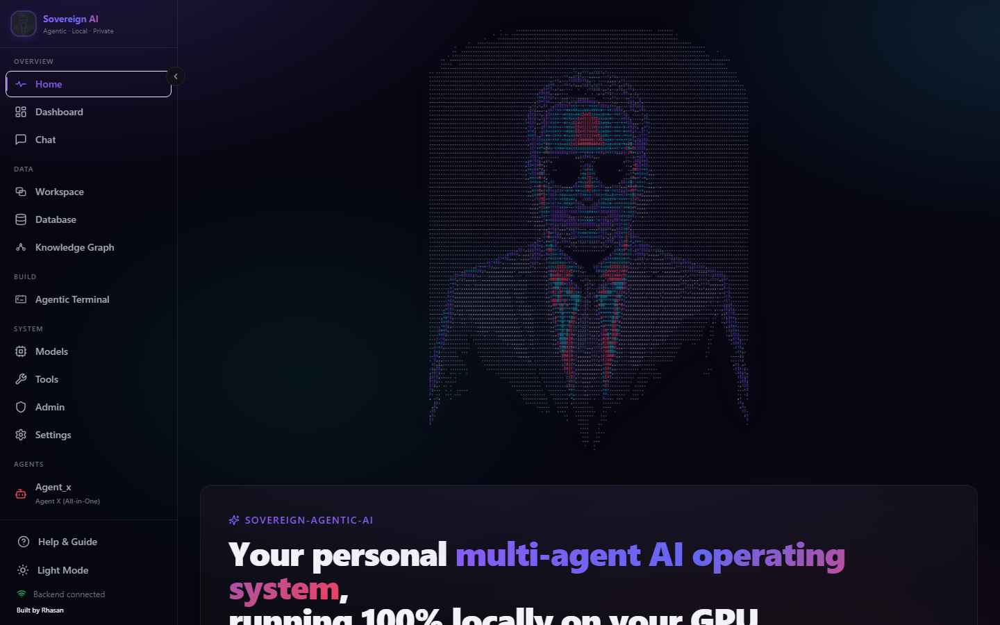
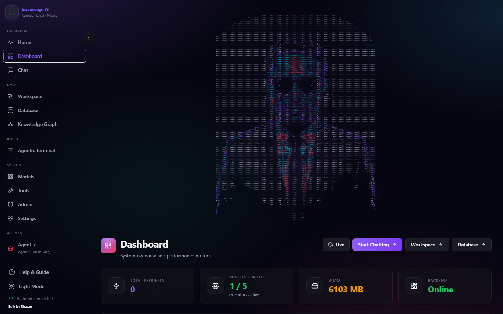
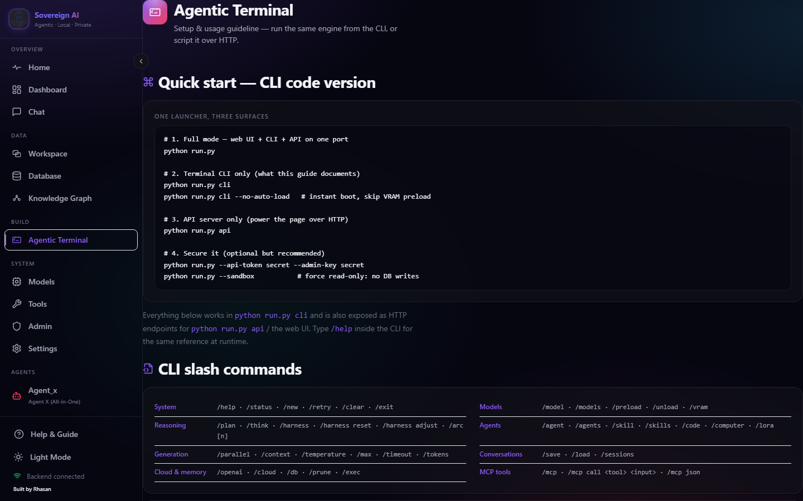
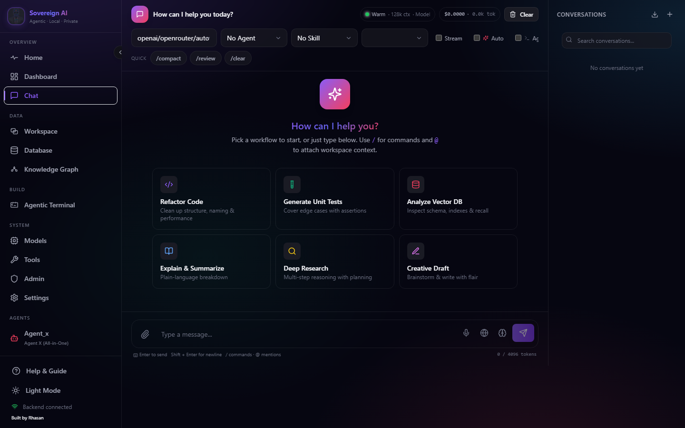
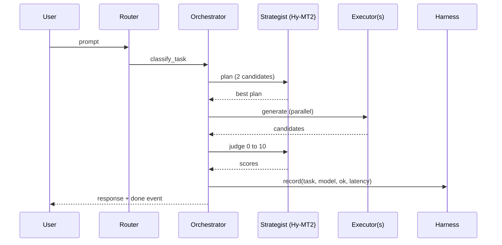
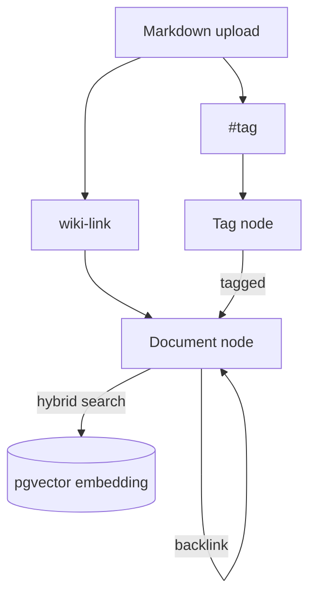

# Sovereign-Agentic-AI

<p align="center">
  
</p>

<p align="center">
  <b>A fully local, privacy-first, multi-agent LLM system that plans, routes, and executes — entirely on your hardware.</b>
</p>

<p align="center">
  
  
  
  
  
  
  
</p>

---

## 📖 About this project

**Sovereign-Agentic-AI** is an open-source, local-first agentic AI stack. It turns small
open-weight models (running on your CPU/GPU through `llama.cpp`) into a **cooperating team**:
a *Strategist* that reasons about the task and writes a plan, a *router* that picks the
best *Executor* model for the job, and (optionally) several executors that answer in
parallel while the strategist *judges* the best reply.

It is built for people who want the power of agentic AI **without sending their data to a
cloud**. Chat, memory, the knowledge graph, image generation, vision, AutoML and the
self-healing agent all run on your machine. The only network calls are the ones you
explicitly turn on (an optional OpenAI/Claude/Groq/OpenRouter/Gemini fallback and optional
web search).

> **One-line summary:** *Plan → Route → Execute → Judge → Remember*, all offline by default.

---

## 🎯 Why this project exists

Most local LLM tools are single-model chat wrappers. Sovereign-Agentic-AI exists to show
that a **small, coordinated multi-agent system** can punch above its weight:

- **Reasoning via planning.** A dedicated strategist model plans before answering, which
  improves quality on code, math and multi-step tasks.
- **Adaptive routing.** A learned fitness score picks the right executor per task instead
  of always using the biggest model.
- **Accountability.** Every answer is judged, scored and recorded, so quality is measurable.
- **Memory that compounds.** Conversations, documents and wiki-links become a queryable
  knowledge graph.
- **Privacy by construction.** No telemetry, no forced cloud, no lock-in.

---

## 🖼️ Screenshots

Real captures from the running system (AMD RX 5600 XT / Vulkan, i3-10100F).

| Landing page | Live Dashboard |
| :---: | :---: |
|  |  |

| Agentic Terminal | Chat |
| :---: | :---: |
|  |  |

---

## 🧭 How to use it

**1. Install**

```bash
pip install -e .          # or: pip install -r requirements.txt
sovereign-llm             # full mode (Web UI + CLI + API)
```

**2. Add models.** Drop `.gguf` files into `models/` (expected: `Hy-MT2-1.8B-Q4_K_M.gguf`,
`gemma-4-E4B-it-qat-UD-Q2_K_XL.gguf`, `Qwen2.5-Omni-3B-Q4_K_M.gguf`,
`mythos-nano-Q5_K_M.gguf`). Any `.gguf` is auto-discovered.

**3. Run**

```bash
python run.py                                  # full mode (recommended)
python run.py web                              # Web UI only
python run.py cli                              # Terminal CLI only (see /terminal setup guide)
python run.py --image-gen --vision --automl     # enable opt-in features
python run.py --db --db-password postgres        # PostgreSQL + pgvector memory
python run.py --nextjs                          # Next.js dev server on :3001
```

**Typical workflows**
- **WebUI (multipage):** `/` is a landing page (architecture flow, hardware models,
  Hugging Face download guide, datasets, live system pulse), `/dashboard` is the live
  metrics dashboard, and `/terminal` is the Agentic Terminal — an IDE-style workspace
  plus a full **CLI setup & usage guide**.
- **Chat (UI):** open the dashboard, pick an agent/skill, stream answers.
- **Chat (API):** POST `/v1/chat/completions` (OpenAI-compatible) or `/v1/chat/auto-stream`.
- **Knowledge:** upload `.md` files to a workspace → wiki-links, `#tags` and backlinks
  become a searchable graph.
- **Automation:** drive it via `/mcp` JSON-RPC from another tool.
- **Evaluation:** `python -m arc` / `POST /v1/...` for ARC grid-reasoning accuracy.

---

## 🏗️ Architecture & structural diagrams

### System overview


### Request lifecycle (sequence)



### Knowledge graph structure



---

## ⚙️ How it works (the math)

### 1. Task classification
```text
classify_task(text) -> one of
  {code, math, summarize, translate, tool, creative, general}
```

### 2. Planning — two candidate plans
The strategist generates **2 candidate plans** (`i in {0,1}`) at temperatures
`0.3 + i*0.1`; the higher-scoring plan wins:

```text
score(plan) = len(plan)
             + 10 * 1{"FINAL_ANSWER" in plan}
             +  5 * 1{len(plan) > 50}

best_plan = argmax score(plan)
```

### 3. Adaptive harness — fitness score
Each `(task, model)` earns fitness from **success**, **speed** and **recency**:

```text
success = 1 - errors / attempts
speed   = min(2.0, 1 / avg_latency)      # avg_latency in seconds
recent  = decay ^ age ,  age = generation - last_gen ,  decay = 0.95

fitness(task, model) = 60*success + 30*speed + 10*recent
```

Routing is **epsilon-greedy** (`epsilon = 0.15`):

```text
choose(task, candidates):
    with probability 0.15: return random(candidates)   # explore
    else:                  return ranked(task, candidates)[0]  # exploit
```

### 4. Parallel execution & judging
Up to `parallel_max` (default 2) executors answer concurrently; the strategist scores
each 0–10 and the best wins:

```text
judge(Q, A) in [0, 10]
final = argmax_{m} judge(Q, A_m)
```

### 5. Auto-streaming decision
```text
should_auto_stream =
    auto_stream_enabled
    AND max_tokens <= auto_stream_max_tokens        # cap = 2048
    AND ( use_planning
        OR len(message) > 100
        OR message matches code|creative keywords )

max_tokens := min(max_tokens, auto_stream_max_tokens)   # hard cap
```

SSE emits a terminal `done` event:

```json
{"type":"start",   "model":"gemma-4-e4b"}
{"type":"thinking","content":"..."}
{"type":"response","content":"..."}
{"type":"done",    "model":"gemma-4-e4b", "tokens":142, "elapsed":3.1}
```

### 6. Throughput
```text
tokens_per_sec_window = sum(tokens in last 60s) / 60
tokens_per_sec        = total_tokens_out / uptime
```

### 7. ARC reasoning accuracy
```text
accuracy = correct / total
_matches(pred, target, exact):
    if exact:  return parse_grid(pred) == target
    else:      return len(pred) <= len(target)
                and every pred row has len == len(target[0])
                and element-wise pred == target
```

---

## 🛠️ Capabilities

| Capability | Status | Notes |
|------------|--------|-------|
| Multi-agent plan → execute → judge | ✅ | Hy-MT2 plans, executors run, strategist judges |
| Adaptive per-task model routing | ✅ | Epsilon-greedy harness fitness |
| Parallel multi-model answers | ✅ | ≤ `parallel_max`, judged 0–10 |
| Token streaming + auto-stream | ✅ | SSE, per-request stream/batch |
| GBNF auto-approved workflow | ✅ | Agent Loop: [THINK]/[BASH]/[READ]/[WRITE]/[DONE] |
| Workspaces + file knowledge | ✅ | Chunk-embedded, per-workspace search |
| Knowledge graph (wiki-links, tags, backlinks) | ✅ | pgvector + recursive-CTE shortest path |
| Agents & skills (API/CLI/MCP) | ✅ | Runtime CRUD, JSON-persisted |
| Multipage WebUI (Next.js) | ✅ | Landing `/` + live `/dashboard` + Agentic Terminal `/terminal` |
| Agentic Terminal | ✅ | Sandboxed shell / Python / file-tree, plus `/v1/terminal/*` HTTP API |
| Image generation (Stable Diffusion) | ✅ opt-in | CPU, RAM-guarded, 256–512 px |
| Vision (Gemma 3) | ✅ default-on | CPU, resource-guarded |
| AutoML (auto-sklearn) | ✅ opt-in | Linux-only |
| Self-healing agent | ⚠️ gated | Diagnosis always; **execution** needs `--allow-unsafe-healing` |
| OpenAI-compatible API | ✅ | Drop-in `/v1/chat/completions` |
| Cloud fallback | ✅ opt-in | Rate-limited OpenAI/Claude/Groq/OpenRouter/Gemini |
| Model management UI | ✅ | Pull from URL, install, uninstall, sizes |
| Hardware monitor (SSE) | ✅ | 30s tick, LRU eviction, CPU throttle, `/v1/hardware/stream` |
| CLI tab-completion + help | ✅ | Readline + Windows custom editor, categorized `/help` |

---

## 📤 Outputs

| Output | Shape | Notes |
|--------|-------|-------|
| Chat completion | OpenAI-style JSON | `choices[0].message.content` (+ optional `thinking`) |
| Streaming events | SSE `start → thinking? → response* → done` | `done` carries `tokens` + `elapsed` |
| Plan / thinking | text | Surfaced in UI and SSE |
| Ranked candidates | dict | Each model's answer + judge score (parallel mode) |
| Memory | pgvector rows | Q/A + graph nodes/edges |
| Knowledge graph | nodes/edges/tags | Wiki-links, `#tags`, backlinks, shortest path |
| Images | `generated/*.png` | From `--image-gen` |
| Vision | description text | From `--vision` |
| AutoML model | `.pkl` | From `--automl` |
| Metrics / Harness stats | JSON | `success_rate`, `avg_latency`, `tokens_per_sec_window`, fitness |

---

## 📊 SWOT analysis

| | |
|---|---|
| **Strengths** | 100% local/private; multi-agent planning+judging; adaptive routing; knowledge graph; 808 automated tests; clean static audit; MIT + transparent. |
| **Weaknesses** | Small models → weaker than frontier LLMs; runs best on modest hardware (slow on CPU); vision/AutoML/image-gen are resource-heavy; some features Linux-only (AutoML). |
| **Opportunities** | Drop-in OpenAI-compatible API; MCP integration; workspace knowledge; extensible agents/skills; easy to add new GGUF models; ideal for on-prem / air-gapped deployments. |
| **Threats** | Upstream `llama.cpp`/transformers API drift; large-model competition; hardware fragmentation (Vulkan/ROCm/CUDA); supply-chain risk in optional deps. |

---

## 🤝 Why trust an indie developer?

Legitimate question. Trust here is built on **verifiability, not authority**:

- **Open source under MIT** — every line is inspectable; you can audit, fork and self-host.
- **Reproducible** — `requirements.txt` / `pip install -e .` gives a deterministic local build.
- **Tested** — **808 offline tests, 0 failures**, plus a full static audit (mypy, pyflakes,
  bandit, vulture, pydocstyle, ESLint) that is clean. Both run automatically in
  [GitHub Actions CI](.github/workflows/ci.yml) on every push.
- **Transparent about limits** — known, non-critical issues are tracked publicly in
  [`KNOWN_ISSUES.md`](KNOWN_ISSUES.md); nothing is hidden.
- **Privacy by construction** — no telemetry; data stays on your device unless you opt in.
- **Security-hardened** — the self-healing code-execution is gated, terminal shell
  commands are sandboxed to the project directory, uploaded files are served safely, and
  graph referential integrity is enforced (see below).
- **Documented** — architecture, math, API and safety are all written down
  ([AGENTS.md](AGENTS.md), [AUDIT_REPORT.md](AUDIT_REPORT.md), [CHANGELOG.md](CHANGELOG.md),
  [KNOWN_ISSUES.md](KNOWN_ISSUES.md)).

> If you can read Python, you can verify every claim on this page yourself. That is the
> point of local-first software.

---

## 🔐 Security & hardening

- **Self-healing RCE gate** — `heal()` refuses to run caller-supplied Python unless
  `--allow-unsafe-healing` is passed. `--healing` alone only enables diagnosis.
- **Sandboxed shell commands (v1.2.1)** — `/v1/terminal/exec` rejects commands that escape
  the project directory: `..` traversal (incl. spaced escapes), drive-absolute paths
  (`C:\`), UNC paths, and absolute `cd`. Sandboxed `shell=True` subprocesses stay confined
  to the project root.
- **Stored XSS** — `/generated` is served by `SafeStaticFiles`: `X-Content-Type-Options:
  nosniff` and `Content-Disposition: attachment` for inline-dangerous types (`.html`,
  `.svg`, `.xml`, `.js`).
- **Graph referential integrity** — `#tags` are materialized as real graph nodes
  (`node_type='tag'`) and linked node→node, so tag edges no longer corrupt the `edges` FK.
- **Vision API** — switched to Gemma 3 (`google/gemma-3-4b-it`) processor-based
  generation; PaliGemma and the `moondream2` `answer_question` pipeline remain as
  fallback model paths. On by default; the model lazy-loads on first analysis.
- **UTF-8-safe self-healing** — healing snippets are written as UTF-8 and the
  `HealingRequest.timeout_s` API field is capped at 1–120 s.

---

## ⚠️ Limitations & liability

This software is provided **"AS IS", without warranty of any kind** (see
[LICENSE](LICENSE)). In addition:

- It is **experimental**. Model output can be wrong, unsafe, or biased; always verify
  important results.
- Optional features — vision, image generation, AutoML, and especially the **self-healing
  agent** — execute model/code on your machine. The healing agent can run **arbitrary
  Python**; only enable `--allow-unsafe-healing` on a trusted, local machine, never on a
  host reachable from untrusted networks.
- The authors are **not liable** for any damages, data loss, or harm arising from use,
  misuse, or inability to use the software.
- Performance depends entirely on your hardware; CPU-only inference is slow by design.

---

## ©️ Copyright & license

- **Copyright (c) 2025–2026 Rakibul Hasan (Rhasan_Indie_dev).**
- Licensed under the **MIT License** — you may use, copy, modify, merge, publish,
  distribute, sublicense, and/or sell copies, provided the copyright notice and permission
  notice are included. See [LICENSE](LICENSE).
- **Attribution:** keep the copyright/license notice in source distributions.
- **Trademarks:** "Sovereign-Agentic-AI" is the project name; third-party model and tool
  names (llama.cpp, moondream2, auto-sklearn, Next.js, etc.) belong to their owners.

---

## ❓ FAQ

**Q: Can I trust an indie dev's AI with my data?**
A: The app is local-first — no telemetry, and nothing leaves your machine unless you
explicitly enable a cloud fallback or web search. You can read the entire codebase; the
808-test suite and public audit let you verify behaviour yourself.

**Q: Is it free / can I use it commercially?**
A: Yes. MIT licensed — free for personal and commercial use, with attribution.

**Q: What if there are bugs?**
A: 808 automated tests + a clean static audit cover the core; remaining non-critical
items are listed transparently in `KNOWN_ISSUES.md`.

**Q: Who is liable if the healing agent executes bad code?**
A: The software is provided "AS IS" with no warranty (see Limitations & liability). Keep
`--allow-unsafe-healing` off unless you are on a trusted local machine and understand the
risk.

**Q: How is this different from Ollama / LM Studio / LocalAI?**
A: Multi-agent planning **and** judging, an adaptive per-task harness, a knowledge graph,
and parallel multi-model execution — none of which those tools provide.

---

## 🧪 Testing & quality

```bash
python test_all.py          # 808 offline tests, 0 failures
python test_system.py 8070   # live integration tests
python test_load.py --port 8070
python run_deep_audit.py     # mypy + pyflakes + bandit + vulture + pydocstyle + ESLint
```

| Check | Result |
|-------|--------|
| GitHub Actions CI | Python tests + Next.js build on every push (badge above) |
| Unit tests | **808 / 808 passed** |
| Pyflakes / Bandit / Vulture | clean |
| TypeScript build | pass (13 routes) |
| ESLint (frontend) | pass |

Non-critical deferred items: [`KNOWN_ISSUES.md`](KNOWN_ISSUES.md). Full audit:
[`AUDIT_REPORT.md`](AUDIT_REPORT.md).

---

## 💻 Hardware profile (reference build)

| Component | Spec | Usage |
|-----------|------|-------|
| GPU | AMD Radeon RX 5600 XT (6 GB, Vulkan) | Hy-MT2 ~1.1 GB, Gemma 4 E4B ~3 GB, Qwen2.5-Omni ~2.5 GB, Mythos-nano ~2.7 GB |
| CPU | Intel i3-10100F (4C/8T) | threads auto-set to `cores // 2` |
| RAM | 16 GB | context capped to 2048 when < 16 GB |
| Disk | 256 GB SSD | pgvector + IVFFlat/HNSW indexes |

---

## 📊 Comparison

| Feature | **Sovereign-Agentic-AI** | Ollama | LM Studio | LocalAI |
|---|---|---|---|---|
| Multi-agent planning + judging | ✅ | ❌ | ❌ | ❌ |
| Adaptive harness routing | ✅ | ❌ | ❌ | ❌ |
| pgvector memory + graph | ✅ | ❌ | ❌ | ❌ |
| Parallel multi-model + judge | ✅ | ❌ | ❌ | ❌ |
| Self-healing (gated) | ✅ | ❌ | ❌ | ❌ |
| AutoML (Linux) | ✅ | ❌ | ❌ | ❌ |
| Hardware auto-tune + monitor | ✅ | manual | manual | manual |
| Vision + image-gen + LoRA (CPU) | ✅ | partial | partial | partial |

---

## 📄 License

MIT — see [LICENSE](LICENSE).

---

<p align="center"><sub>Built by <a href="https://rhasan-dev-bd-com.vercel.app/">Rakibul Hasan</a> (Rhasan_Indie_dev). Local. Fast. Private.</sub></p>
